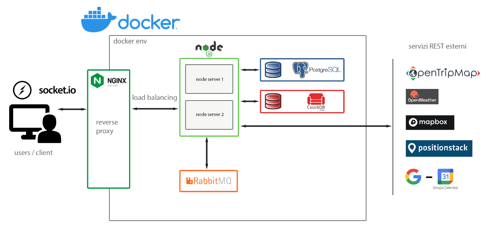

## SCOPO DEL PROGETTO

Trip Planner è una web application per la pianificazione di viaggi che media tra utente e database allo scopo di velocizzare la ricerca e la creazione di itinerari di viaggio, favorendo la collaborazione tra i viaggiatori di tutto il mondo. 
Che siate viaggiatori esperti o alle prime armi, con Trip Planner otterrete itinerari su misura, personalizzati sulla base delle vostre esigenze. 
Una volta creato l’account, compito dell’utente sarà solo inserire la meta, la durata del viaggio e gli argomenti di interesse. Questa funzione di ricerca vi permetterà di visualizzare e selezionare itinerari creati dagli altri viaggiatori e filtrati in base alle vostre richieste. Qualora il viaggio perfetto per voi non comparisse tra i risultati, potrete decidere di costruirlo da zero selezionando manualmente le tappe, che appariranno sulla mappa come punti colorati in base ai filtri inseriti (architecture, cultural, food, hotel, natural, religion). L’itinerario scelto sarà condivisibile e modificabile. 
Attraverso l’integrazione con Google Calendar, potrete inoltre sincronizzare il vostro itinerario per non perdere nessun appuntamento di viaggio.

## ARCHITETTURA DI RIFERIMENTO



## **SODDISFACIMENTO DEI REQUISITI**

1. *Il servizio REST che implementate (lo chiameremo SERV) deve offrire a terze parti delle API documentate*:
    * Trip-Planner fornisce API che permettono agli utenti di interagire con il database degli itinerari. In particolare è possibile:
      * pubblicare un itinerario
      * ottenere informazioni su un itinerario esistente
      * effettuare una ricerca filtrata nel database degli itinerari
    * Per generare la documentazione è stato utilizzato ApiDoc. 
    * La documentazione è disponibile in https://localhost:8083/apidoc

   

2. *SERV si deve interfacciare con almeno due servizi REST di terze parti (e.g. google maps):*

    * La nostra webapp si interfaccia a molteplici servizi REST:

      * OpenTripMap (https://opentripmap.io/): per la ricerca dei punti di interesse
      * OpenWeatherMap (https://openweathermap.org/): per ottenere informazioni sul meteo nelle varie tappe del viaggio
      * mapbox (https://www.mapbox.com/): per fornire agli utenti una visualizzazione grafica su mappa dei punti di interesse 
      * positionstack (https://positionstack.com/): per il servizio di reverse geolocation
      * Google Calendar:  per consentire agli utenti di salvare itinerari sul loro calendario google

      

3. *Almeno uno dei servizi REST esterni deve essere “commerciale”*.

4. *Almeno uno dei servizi REST esterni deve richiedere oauth, Non è sufficiente usare oauth solo per verificare le credenziali è necessario: accedere al servizio:*

   * tra i servizi REST a cui ci interfacciamo, Google Calendar rientra in queste categorie

   

5. *La soluzione deve prevedere l'uso di protocolli asincroni. Per esempio Websocket e/o AMQP (o simili es MQTT):*

   * La nostra webapp necessita di protocolli asincroni per il funzionamento del sistema dei like e relative notifiche

   * Trip-Planner implementa il protocollo Websocket tramite Socket.io e AMQP attraverso RabbitMQ 

     

6. *Il progetto deve prevedere l'uso di Docker e l'automazione del processo di lancio, configurazione e test:*

   * Tutte le entità della rete della nostra applicazione sono container docker orchestrati con docker compose.

     

7. *(Il progetto deve essere su GIT (GITHUB, GITLAB ...) e documentato con un README)*:

    * Per lo sviluppo dell'applicazione è stato utilizzato github: https://github.com/simonetablo/Progetto-RC.git

      

8. *Deve essere implementata una forma di CI/CD per esempio con le [Github Actions](https://www.google.com/url?q=https%3A%2F%2Fdocs.github.com%2Fen%2Factions&sa=D&sntz=1&usg=AOvVaw27i5M6TMj0YGA3edcYfLyY)*:

   * La nostra webapp utilizza le Github Actions implementando:

     * Testing automatico della web app

     * Testing automatico delle API REST offerte 

       

9. *Requisiti minimi di sicurezza devono essere considerati e documentati. Self-signed certificate sono più che sufficienti per gli scopi del progetto.*

   * Trip-Planner accetta solo richieste https autorizzate tramite l'utilizzo di Self-signed certificate.

   * Sono presenti regole di instradamento (iptables)  per accettare tutte le connessioni già stabilite

     

## **INSTALLAZIONE**

- Per l'installazione e la configurazione sono necessari:

  - docker

- Il processo di installazione deve avvenire tramite i seguenti passaggi:

  - Eseguire un `git clone` del repository:

    ```
    git clone https://github.com/simonetablo/Progetto-RC.git
    ```

  - Posizionarsi nella root directory e creare un file `.env` strutturato come segue:

    ```
    COUCHDB_USER=********************
    COUCHDB_PASSWORD=********************
    
    POSTGRES_PASSWORD=********************
    POSTGRES_USER=********************
    POSTGRES_DB=********************
    
    SESSION_SECRET_KEY=********************
    
    USE_EMAIL_APP=true
    EMAIL_APP=********************
    EMAIL_APP_PASSWORD=********************
    EMAIL_SECRET=********************
    
    CLIENT_ID=********************
    CLIENT_SECRET=********************
    
    OPENTRIPMAP_KEY=********************
    OPENWEATHERMAP_KEY=********************
    MAPBOX_KEY=********************
    POSITIONSTACK_KEY=********************
    ```

    * USE_EMAIL_APP, EMAIL_APP, EMAIL_APP_PASSWORD: E' possibile abilitare o disabilitare la verifica dell'account mediante email impostando USE_EMAIL_APP rispettivamente a "true" o "false".
      Nel caso in cui la verifica sia abilitata, è necessaria una email google (EMAIL_APP) su cui è necessario impostare una *app password* (EMAIL_APP_PASSWORD)
    * CLIENT_ID, CLIENT_SECRET: Per usufruire dei servizi di OAuth occorre registrare l'applicazione su Google Cloud Platform cosi' da poter ottenere le credenziali (client secret,client id) necessarie per effettuare la richiesta di un token di accesso. Inserire http://localhost:8083/red_uri come redirect uri.
      Per usufruire dei servizi di Calendar è necessario abilitare tali servizi nella schermata Api e Servizi relativa alla nostra applicazione su Google Cloud Platform

  - Eseguire il comando `docker-compose up`

- Per Utilizzare l'app visitare `https://localhost:8083`

- Per accedere alla documentazione delle API visitare `https://localhost:8083/apidoc`

## **TEST**

I test sono implementati con l'ausilio della libreria di testing asincrono `mocha ` e della libreria  di assertion `chai`

- Per testare le funzionalità della web application e dei servizi API è necessario:
  - Partendo dalla directory root spostarsi nella cartella `node` 
  - eseguire il comando `npm test`

I test hanno un tempo di esecuzione variabile. Lasciar andare il programma fin quando non saranno disponibili i risultati.

